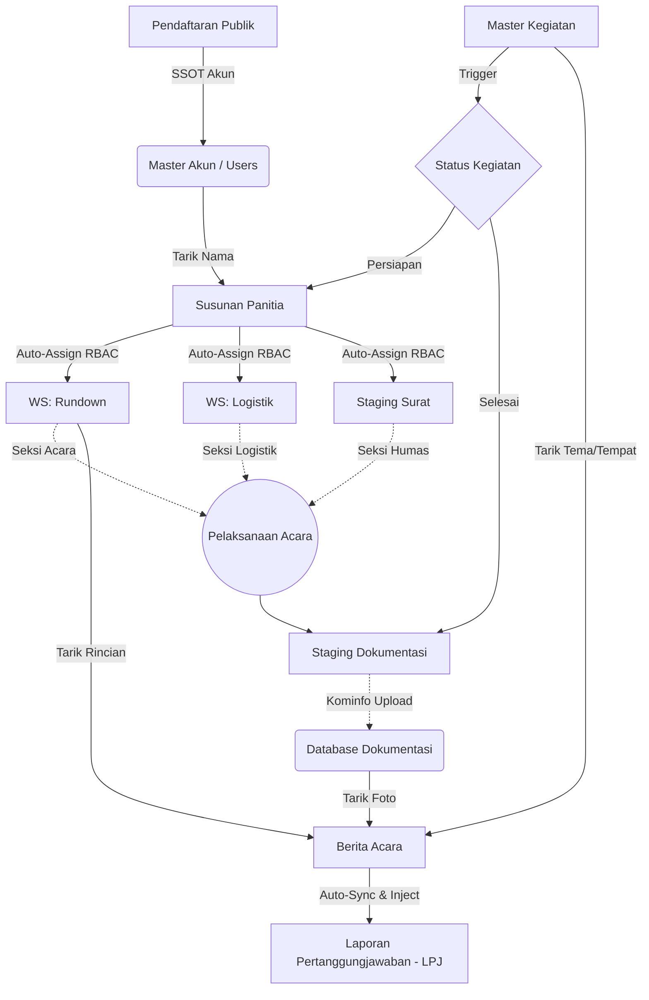

# 🛠️ Panduan Developer BPM (Developer Guide)
*Dokumen Onboarding & Analisis Keterhubungan Sistem*

Selamat datang di *codebase* Sistem Manajemen BPM! Sistem ini dibangun dengan fokus pada efisiensi, keamanan, dan otomatisasi tingkat tinggi. Sebagai *developer* baru, Anda **wajib** memahami filosofi arsitektur di bawah ini sebelum melakukan perubahan pada basis kode.

---

## 1. Filosofi Arsitektur Utama

Sistem ini menganut tiga pilar utama:
1. **Single Source of Truth (SSOT):** Data dasar (seperti Nama Anggota, Jabatan, dan Master Kegiatan) hanya diinput **satu kali** di modul intinya. Modul lain *wajib* menarik data menggunakan Foreign Key (ID), bukan mengetik ulang teks *hardcoded*.
2. **Event-Driven Workflow:** Pekerjaan satu divisi memicu tugas untuk divisi lain. (Misal: Kegiatan berstatus *Selesai* otomatis membuka form *Upload* Dokumentasi untuk tim Kominfo).
3. **Smart RBAC (Role-Based Access Control):** Hak akses tidak bersifat global. Akses "Workspace" (seperti Logistik, Acara, Surat) diberikan secara dinamis berdasarkan posisi anggota di tabel `kegiatan_panitia` pada masing-masing kegiatan.

---

## 2. Peta Keterhubungan Sistem (Workflow Map)

Perhatikan diagram berikut untuk memahami bagaimana data mengalir dari tahap Pendaftaran hingga Laporan Akhir (LPJ):

---

## 3. Komponen Krusial & Aturan Modifikasi

### A. Manajemen Akses (RBAC & Sidebar)
* **File Utama:** `admin/core/header.php` dan `includes/functions.php`.
* **Aturan:** JANGAN menggunakan pengecekan `if ($admin_role == 'logistik')` untuk fitur spesifik kegiatan. Gunakan pengecekan *Workspace* berdasarkan tabel `kegiatan_panitia` (contoh: `$ws['event_role'] === 'sie_logistik'`).
* **Pengecualian:** Divisi Kominfo memiliki menu `Staging Dokumentasi` yang hanya muncul secara eksklusif bagi mereka saat ada kegiatan yang berstatus *Selesai*.

### B. Pembuatan Panitia (`buat-panitia.php`)
* Modul ini bukan sekadar membuat PDF SK Panitia, melainkan **otak pembagian akses**.
* Setiap kali panitia disimpan, sistem akan melakukan *auto-sync* ke tabel `kegiatan_panitia`. Inilah yang memicu terbukanya akses *Workspace* bagi akun terkait.

### C. Modul Berita Acara & LPJ
* Modul ini adalah **titik kumpul** (Agregator) dari seluruh pekerjaan.
* **Berita Acara (`buat-berita-acara.php`)** secara otomatis menarik:
  1. *Rundown* dari Sie Acara.
  2. *Dokumentasi JSON* dari Kominfo (`arsip_dokumentasi`).
* **LPJ** menggunakan fitur *Two-Way Sync*. Jika ada perubahan data pada Berita Acara, JSON pada dokumen LPJ akan ter-*update* secara otomatis. Jangan merusak struktur array JSON-nya.

### D. Manajemen File / Gambar
* **File Utama:** `includes/functions.php` -> fungsi `uploadFile()`.
* **Aturan:** JANGAN menggunakan `move_uploaded_file()` secara manual. Selalu gunakan fungsi `uploadFile()` yang sudah terintegrasi dengan Object Storage (S3) dan pengamanan tipe file (Otomatis konversi ke WebP). Untuk merender gambar di *frontend*, gunakan fungsi `uploadUrl($nama_file)`.

---

## 4. "What NOT To Do" (Pantangan Developer)
1. ❌ **Membuat Input Teks Bebas untuk Nama Pengguna.** Selalu gunakan elemen `<select>` yang ditarik dari *database* (`users`).
2. ❌ **Meminta File/Data yang Sama Dua Kali.** Jika data sudah pernah diinput divisi lain (contoh: *Rundown*), buatlah API *fetcher* (`api-get-kegiatan-data.php`) untuk menariknya secara otomatis, jangan menyuruh *user* mengunggah/mengetik ulang.
3. ❌ **Mengabaikan Sinkronisasi LPJ.** Modul-modul di BPM (BPM & BPM) dirancang untuk berujung pada kemudahan pembuatan LPJ. Jika Anda membuat fitur operasional baru, pikirkan *"Bagaimana data ini bisa otomatis masuk ke laporan akhir?"*.

---
*Dokumen ini dibuat dan dijaga untuk kelancaran regenerasi tim IT BPM. "Code with logic, design with empathy."*
